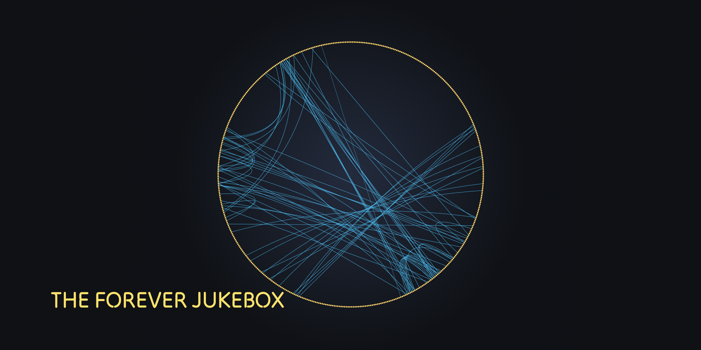

### Local modifications
This fork was created to add a couple of features I wanted, eg. extra information

Changes:
- Some adjustments to UI elements (personal preference).
- Added a "Branch Chance" display to show the current probability of branching at the next beat.
- bpm visualizer
- random stuff i liked

have fun

# The Forever Jukebox



The Forever Jukebox is a self-hosted, end-to-end system that analyzes audio,
serves the results via a lightweight API, and powers a refreshed Infinite
Jukebox-style web UI with branching playback and multiple visualizations. It
also includes an installable offline PWA and a native Android app for on-device
playback. It replaces reliance on the deprecated Spotify Audio Analysis engine
by generating similar beat/segment/section data locally.

## Structure

- `engine/` — The Forever Jukebox audio analysis engine (with optional calibration support).
- `api/` — REST API + worker that calls the engine.
- `web/` — Web UI.
- `pwa/` — Offline/local analysis PWA that can also export jukebox audio.
- `android/` — Native Android app.
- `schema.json` — JSON schema reference for analysis output.

## Quick Start

Prereqs: Python 3.10, npm (Node.js).

All-in-one (dev):

```bash
./dev.sh
```

Then open the web UI at `http://localhost:5173`.

## Android (native app):

- Download: [GitHub Releases](https://github.com/creightonlinza/forever-jukebox/releases/latest)
- Signature (SHA-256):

```bash
  B5:30:EB:FD:C1:7E:C2:D0:1A:2E:9A:9D:D9:DD:02:CA:5D:2F:E0:7A:E2:C6:E5:F8:45:E7:FF:41:FD:78:B4:4D
```

## Docker (production)

Build and run the container with Docker Compose (serves web UI + offline PWA + API):

```bash
export SPOTIFY_CLIENT_ID=...
export SPOTIFY_CLIENT_SECRET=...
export YOUTUBE_API_KEY=...
export ADMIN_KEY=...
export NTFY_TOPIC_KEY=...
export WORKER_COUNT=1
export MAX_TRACK_LENGTH=12
export ALLOW_USER_UPLOAD=false
export ALLOW_USER_YOUTUBE=false
export ALLOW_FAVORITES_SYNC=false
export AUTO_UPDATE_YTDLP=true
export AUTO_UPDATE_DENO=true
docker compose up --build
```

`ENGINE_CONFIG` is optional and unused by default; set it only when you explicitly want to use calibration parameters.
`MAX_TRACK_LENGTH` is optional (minutes) and limits both user-upload and YouTube analysis jobs by duration.
`AUTO_UPDATE_YTDLP` and `AUTO_UPDATE_DENO` are optional startup flags for container boot-time upgrades (`true`/`false`, default `true`).
You can also put these values in a `.env` file (same directory as
`docker-compose.yml`) and Compose will load them automatically.

Open:

- Web UI: `http://localhost:8000/`
- Offline PWA: `http://localhost:8000/offline/`

API routes are under `/api/*`. The Compose file uses a named Docker volume
(`storage`) to persist `/app/api/storage`.

## For standalone setup, see:

- [`engine/README.md`](https://github.com/creightonlinza/forever-jukebox/blob/master/engine/README.md)
- [`api/README.md`](https://github.com/creightonlinza/forever-jukebox/blob/master/api/README.md)
- [`web/README.md`](https://github.com/creightonlinza/forever-jukebox/blob/master/web/README.md)
- [`pwa/README.md`](https://github.com/creightonlinza/forever-jukebox/blob/master/pwa/README.md)
- [`android/README.md`](https://github.com/creightonlinza/forever-jukebox/blob/master/android/README.md)

## Credits

- The Infinite Jukebox (Paul Lamere): original interactive concept and UX inspiration.
- The Echo Nest / Spotify Audio Analysis: foundational analysis schema and ideas.
- EternalJukebox: keeping the dream alive.
- madmom: beat/downbeat tracking models and utilities.
- Essentia: audio features and DSP toolkits.
- ffmpeg: audio decoding.
- yt-dlp: YouTube search metadata and audio.
- OpenAI Codex (GPT-5): implementation guidance and tooling.
